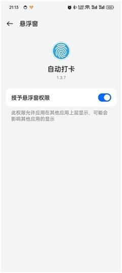
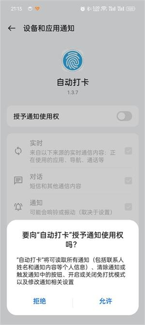
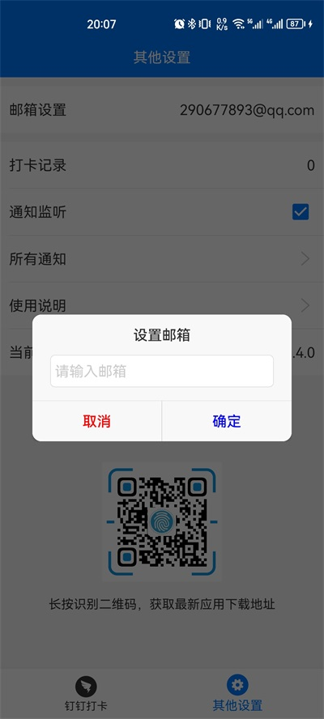
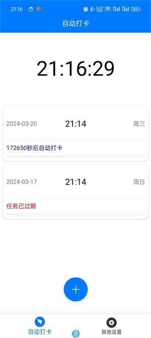
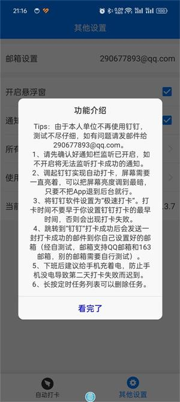
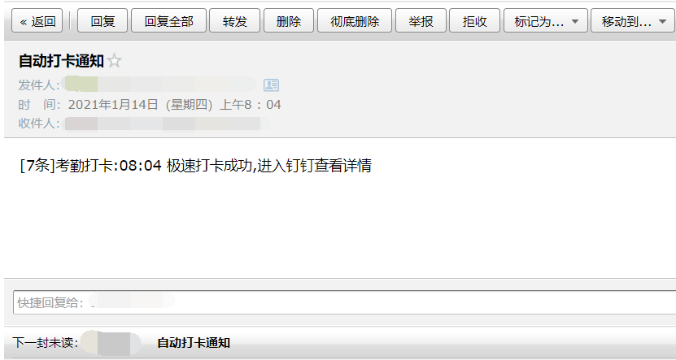

# AutoDingding

Kotlin+Java混编实现的钉钉打卡小工具，解决您上班途中迟到问题，只需一部备用手机置于公司工位，设置一下第二天上班打卡时间，接下来的事就交给我吧。  
相比于之前的版本，此版本做了版本兼容，最低兼容 6.0，最高兼容到Android 12或者鸿蒙 3.0系统。
此应用最开始的本意是方便自己，但后来本人换了新的单位，此款工具软件也就不用了，所以选择开源，有不到之处还请谅解。  
本应用仅限学习和内部使用，严禁商用和用作其他非法用途，如有违反，与本人无关！！！  
本应用的出发点是为了解决上班路途遥远，或者每天卡点上班族的燃眉之急，出发点自认为是友好的，但是，不可滥用！！！

# 说几句（最新版本 1.3.5 ）

本不想多说什么的，奈何总有人问，那我就给你们问的人统一回复下！  
**开篇我就说过了，我早已经换了单位，这个软件已经用不上了，以后估计很少会更新版本或者不会更新版本了，有能力的可以自行下载源码修改。**  
其次，总有人提自己把锁屏功能关掉，弄个定时闹钟，到点的时候亮屏，再隔一分钟就能自动打卡。  
你们说的这些我都考虑过，也都尝试过。非系统级别应用调用系统AlarmManager会出现不能精准唤醒的问题（这里涉及到PowerManager和CPU唤醒机制），这样会导致迟到，一个月迟到个几次，你们能接受吗？  
我甚至还监听特定的微信或者QQ消息（灭屏后概率收不到消息），监听电话或者短信（必须要电话卡），监听系统闹钟（高版本无法监听）我都试过，以上种种或多或少的都会出现不能按时打卡导致迟到的问题，目前的方式虽然是最笨的，但却是最稳妥的。  
另外，手机灭屏了，关机了可能都不知道，还谈什么打卡？如果觉得亮屏耗电严重，把手机亮度调最低不就行了？  

# 注意！！！

#### [旧版本(app-release.apk)](apk/app-release.apk)

#### [新版本(AUTO_20230902_1.3.5.apk)](apk/release/AUTO_20230902_1.3.5.apk)

# 使用注意事项：

**1、请先确认悬浮窗权限已开启，如不开启将Android 10以上系统可能会出现闪退或者仅能打卡一次且没有邮件通知的问题。（找到"自动打卡"软件，打开悬浮窗权限即可）**  
2、请先确认好通知栏监听已开启，如不开启将无法监听打卡成功的通知。（"其他设置"可以直接跳转到系统通知监听页面，打开开关就好了。放心，不会有其他窃密小动作），然后设置钉钉设置为“极速打卡”。  

  
3、设置打卡结果通知邮箱（经自测试，邮箱设置支持QQ邮箱和163邮箱，别的邮箱有需要的可以自行测试）  
  
好了，基本设置就是这样了，附一张主页面，如下：  

  
4、打卡结果如下：  
a、打卡成功  
  
b、打卡失败（失败原因有很多，比如，钉钉账号被自己另一个手机挤下去，再比如，钉钉未设置极速打卡，或者钉钉应用内部打卡通知或者手机通知被关闭，或者钉钉打卡手机又2个以上，因为钉钉最多只能有两个常用打卡手机等等情况都会导致打卡失败，所以，在使用本软件之前，最好先自行测试一两天没确认没问题之后再使用，谢谢理解！）
