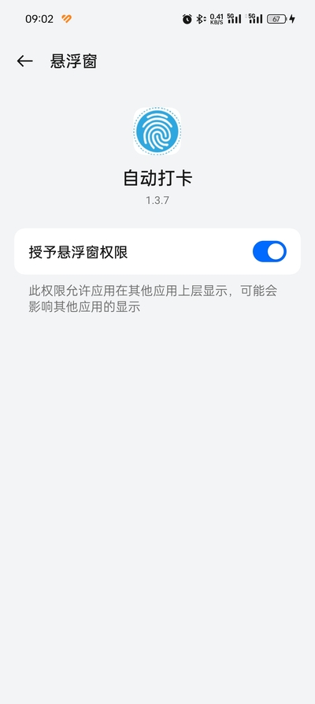
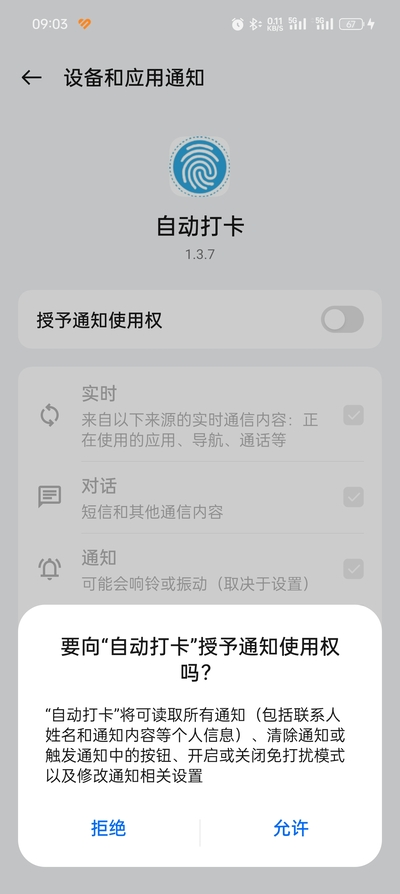
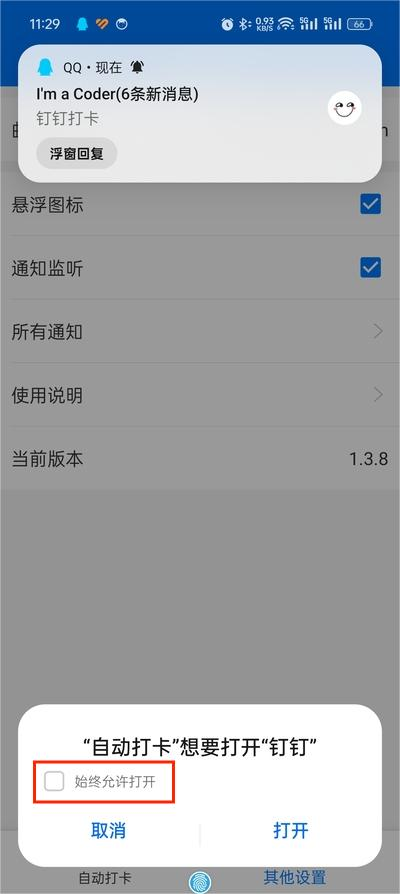
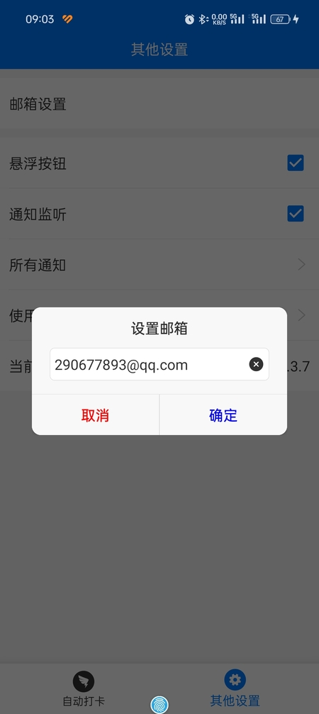
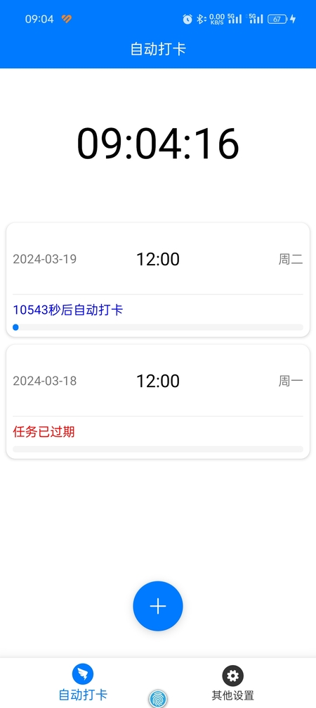
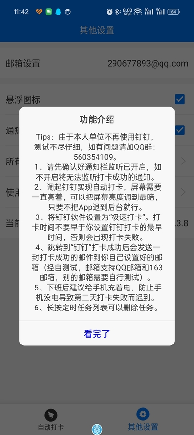

# AutoDingDing

Kotlin+Java混编实现的钉钉打卡小工具，解决您上班途中迟到问题，只需一部备用手机置于公司工位，设置一下上下班打卡时间即可。  
相比于之前的版本，此版本做了版本兼容，最低兼容 6.0（本人测试机版本），最高兼容到Android 14（本人手机版本）或者鸿蒙
3.0系统。 此应用最开始的本意是方便自己，但后来本人换了新的单位，此款工具软件也就不用了，所以选择开源，
有不到之处还请谅解。本应用仅限学习和内部使用，严禁商用和用作其他非法用途，如有违反，与本人无关！！！  
**本应用的出发点是为了解决上班路途遥远，或者每天卡点上班族的燃眉之急，出发点自认为是友好的，但是，不可滥用（如果要用，请做好隐蔽工作，不要被领导看见，如果被发现，后果自负）！！！
**

# 说几句（最新版本 1.5.6）- 更新时间：2024年11月16日14点42分

本不想多说什么的，奈何总有人问，那我就给你们问的人统一回复下！

1. 开篇我就说过了，我早已经换了单位，这个软件已经用不上了，以后估计很少会更新版本或者不会更新版本了，有能力的可以自行下载源码修改。
2. 总有人提自己把锁屏功能关掉，弄个定时闹钟，到点的时候亮屏，再隔一分钟就能自动打卡。你们说的这些我都考虑过，也都尝试过。
   非系统级别应用调用系统AlarmManager会出现不能精准唤醒的问题（这里涉及到PowerManager和CPU唤醒机制），这样会导致迟到，一个月迟到个几次，你们能接受吗？
3. 监听微信或者QQ消息（已实现，但是灭屏后概率收不到消息，这与系统以及推送送达率有关），监听电话或者短信（必须要电话卡），监听系统闹钟（高版本无法监听）我都试过。
4. 以上种种或多或少的都会出现不能按时打卡导致迟到的问题，目前的方式虽然是最笨的，但却是最稳妥的。
5. 另外，手机灭屏了，关机了可能都不知道，还谈什么打卡？如果觉得亮屏耗电严重，把手机亮度调最低不就行了？

# 注意！！！

#### [AUTO_20241116_1.5.6.apk，适合Android 6+系统](apk/auto/release/AUTO_20241116_1.5.6.apk)

1. 降低常驻通知栏刷新频率（1次/s改为1次/min）
2. 缩短打卡超时时间（去掉60s选项，后台ANR可能与此有关）
3. 添加手机不充电也能常亮屏功能（建议把工具设置里面的调整屏幕亮度打开，减小耗电）
4. 日常维护

#### 收不到邮件的问题：

1. 把工具进程杀掉，然后重启工具并关闭工具的通知监听，最后再重新打开工具的通知监听。随便发条消息到手机，如果能在工具的”所有通知“找到刚刚发的消息，则表示可以正常监听通知，否则重复刚刚的操作。
2. 如果依旧收不到邮件，那抱歉，你遇到了最坏的一种情况——钉钉普通通知能收到，但是收不到打卡通知的，那可能是你们公司管理员把打卡通知开关给关了。
   遇到这种情况的，就别挣扎了，老老实实手动打卡吧，或者依旧用此工具，只是收不到邮件罢了，每天有点胆颤心惊担心没打上卡而已，问题也不是很大~~

#### 已知的会被检测到作弊的原因：

| 序号  | 原因                                                 |
|:----|:---------------------------------------------------|
| 1   | 手机已经Root，如果已经手机Root，要么换手机要么刷回没Root前的状态，否则想都别想，必被检测 |
| 2   | 手机开启了无障碍服务或者有别的应用用到了无障碍服务，比如：李跳跳之类的辅助软件            |
| 3   | 使用了模拟定位软件试图修改打卡位置（是任何软件，也包括本软件）                    |
| 4   | 使用了向日葵等远程远程控制软件打开                                  |
| 5   | 手机数据线连着电脑且手机开着开发者模式的USB调试功能                        |
| 6   | 试图使用adb命定模拟手指点击打卡                                  |

#### 如果还有问题，请加QQ群：560354109

#### 历史版本看这里：

| APK                                                                | 版本说明                                                                                                                                                        |
|:-------------------------------------------------------------------|:------------------------------------------------------------------------------------------------------------------------------------------------------------|
| [app-release.apk](apk/history/app-release.apk)                     | 初始版本                                                                                                                                                        |
| [AUTO_20240717_1.4.8.apk](apk/history/AUTO_20240717_1.4.8.apk)     | 完全删除无障碍服务                                                                                                                                                   |
| [AUTO_20240717_1.4.9.apk](apk/history/AUTO_20240717_1.4.9.apk)     | 1. 修改应用入口启动模式，修改APP名 2. 添加钉钉打卡界面倒计时实时显示 3. 解决监听微信无法打卡的问题，添加TIM（轻量版QQ）消息监听                                                                             |
| [AUTO_20240810_1.5.0.apk](apk/history/AUTO_20240810_1.5.0.apk)     | 1. 解决无悬浮窗授权时候跳转钉钉会闪退的问题 2. 解决后台Toast在Android 11以下会闪退的问题 3. 优化日期时间选择，默认显示已有任务的日期时间 4. 添加应用崩溃日志回传 5. 添加时间选择随机秒数 6. 添加钉钉打卡界面倒计时结束后自动回到桌面，再自启动应用 |
| [AUTO_20240814_1.5.1.apk](apk/history/AUTO_20240814_1.5.1.apk)     | 1. 1.5.0补丁版，适配Android 7.1.1系统，解决Android 7.1.1悬浮窗闪退问题                                                                                                        |
| [AUTO_20240830_1.5.2.apk](apk/history/AUTO_20240830_1.5.2.apk)     | 1. 解决选择日期小概率闪退问题 2. 优化悬浮窗初始化逻辑和权限设置 3. 打卡倒计时结束退回桌面改为可选项 4. 添加手机电量查询指令。QQ或者微信或者TIM消息，带有“电量”关键词即可                                                    |
| [AUTO_20240908_1.5.2.2.apk](apk/history/AUTO_20240908_1.5.2.2.apk) | 1. 优化通知监听设置，解决小概率监听失败的问题 2. 添加打卡口令自定义功能，不再监听QQ、微信、TIM的所有消息，只监听用户设置的口令                                                                                    |
| [AUTO_20241012_1.5.3.apk](apk/history/AUTO_20241012_1.5.3.apk)     | 1. 解决悬浮窗无法取消的问题 2. 添加自定义邮件主题通知                                                                                                                           |
| [AUTO_20241031_1.5.5.apk](apk/history/AUTO_20241031_1.5.5.apk)     | 1. 添加支付宝消息打卡响应，修改多条微信消息不响应打卡消息的问题 2. 添加常驻通知栏和锁屏通知显示应用运行状态。注意：锁屏通知不影响打卡 3. 优化通知监听在重启应用后小概率不生效的问题 4. 添加通知记录删除功能                                      |

# 使用注意事项：

1、请先确认悬浮窗权限已开启，如不开启将Android
10以上系统可能会出现闪退或者仅能打卡一次且没有邮件通知的问题。（找到"自动打卡"软件，打开悬浮窗权限即可）

2、请先确认好通知栏监听已开启，如不开启将无法监听打卡成功的通知。（"其他设置"
可以直接跳转到系统通知监听页面，打开开关就好了。放心，不会有其他窃密小动作），然后设置钉钉设置为“极速打卡”。

3、如果想通过QQ或者微信唤起钉钉打卡，需要设置如下图（在“其他设置”界面点击“唤起测试”）：

如果不需要可以跳过此步骤。

4、设置打卡结果通知邮箱（经自测试，邮箱设置支持QQ邮箱和163邮箱，别的邮箱有需要的可以自行测试）

好了，基本设置就是这样了，附一张主页面，如下：

5、打卡结果如下：

| 打卡结果 | 说明                                                                                  |
|:-----|:------------------------------------------------------------------------------------|
| 成功   |                                                              |
| 失败   | 1.钉钉账号被自己另一个手机挤下去   2.钉钉未设置极速打卡   3.钉钉应用内部打卡通知或者手机通知被关闭   4.钉钉打卡手机有2个以上 |

**最后，在使用本软件之前，最好先自行测试一两天没确认没问题之后再使用，谢谢理解！**
