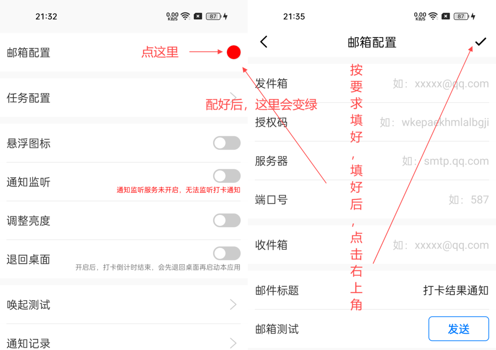
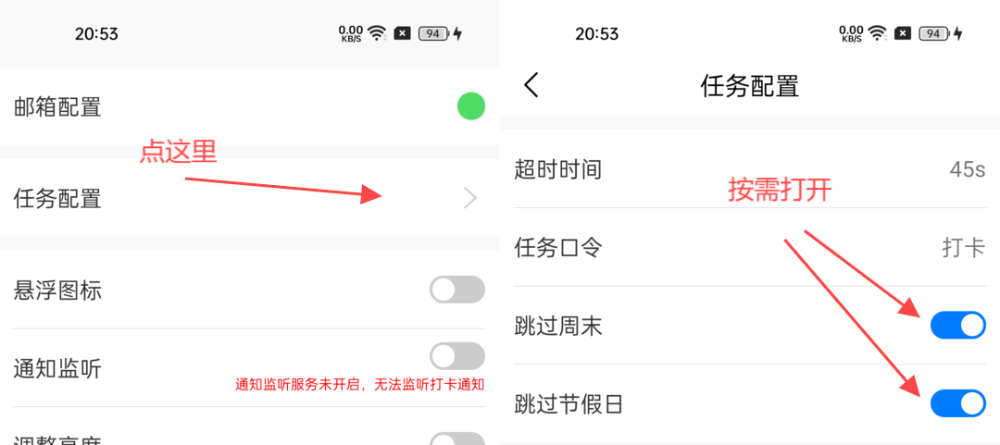
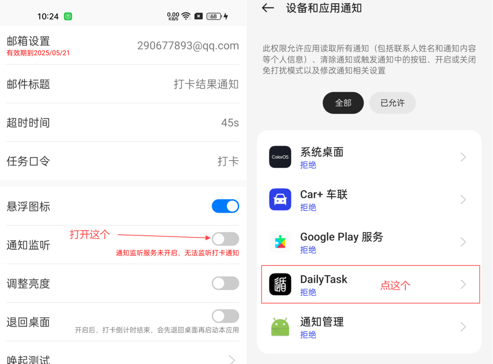
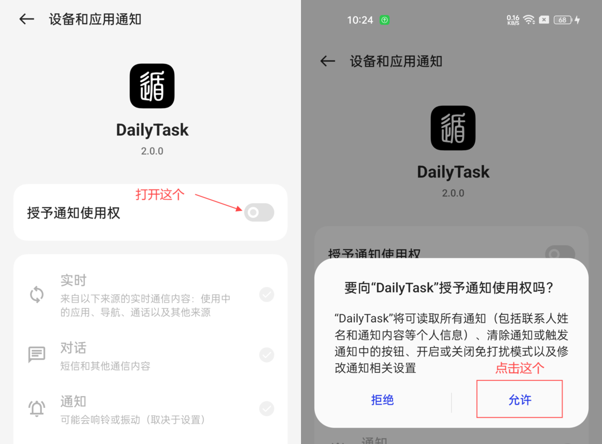
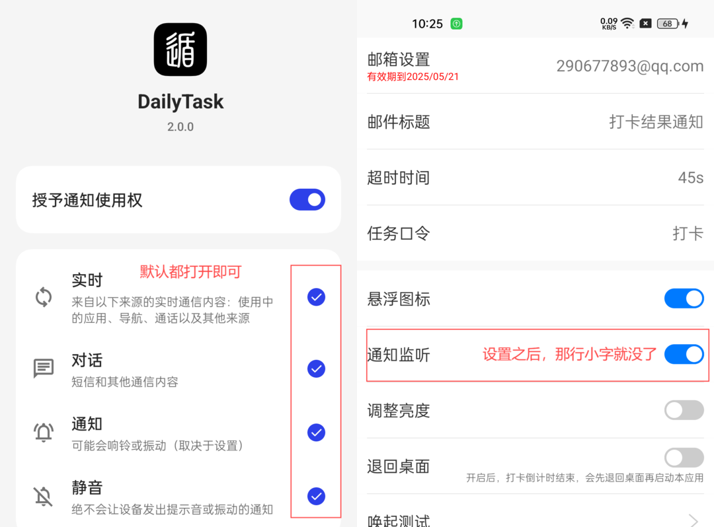
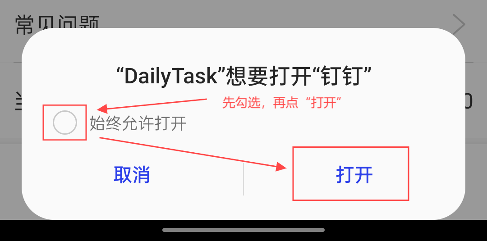
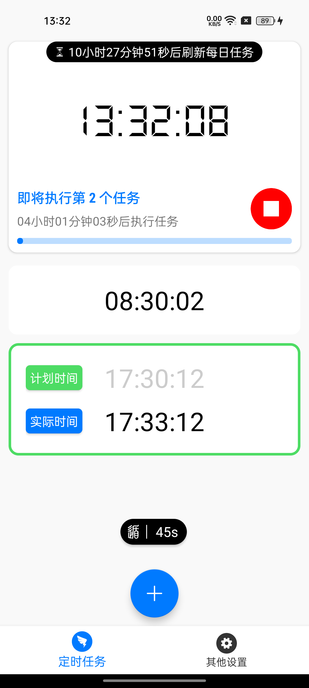
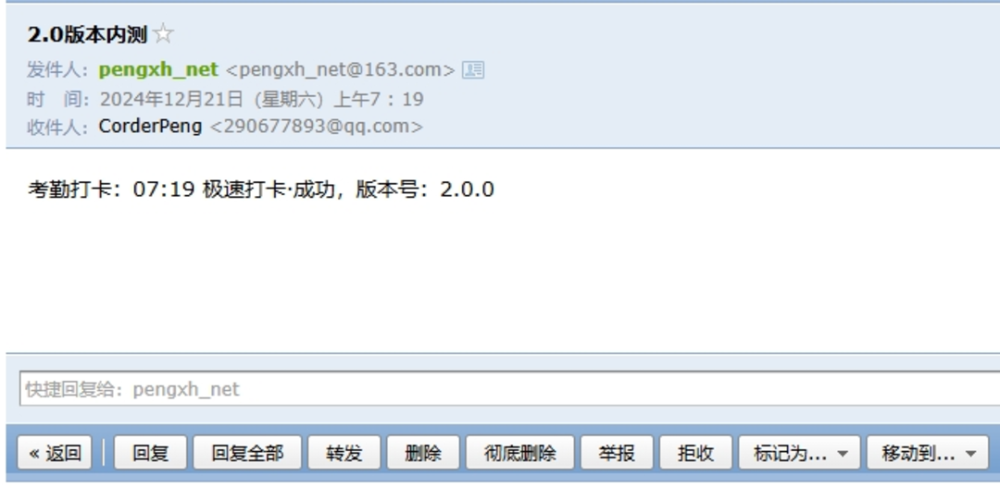

# DailyTask

Kotlin+Java混编实现的钉钉打卡小工具，解决您上班途中迟到问题，只需一部备用手机置于公司工位，设置一下上下班打卡时间即可。  
AutoDingDing（任务精灵）的升级版，相比于之前的版本，做了很多功能提升，但同样也做了版本兼容性调整，`此版本不再兼容8.0以下的系统版本`
，最高兼容到Android 14（本人手机版本）或者鸿蒙 3.0系统。  
此应用最开始的本意是方便自己，但后来本人换了新的单位，此款工具软件也就不用了，所以选择开源，
有不到之处还请谅解。本应用仅限学习和内部使用，严禁商用和用作其他非法用途，如有违反，与本人无关！！！  
**如果要用，请做好隐蔽工作，不要被领导发现，如果被发现，后果自负**

# 最新版本 2.0.0 —— 更新时间：2024年12月26日10点01分

本不想多说什么的，奈何总有人问，那我就给你们问的人统一回复下！

1. 对目前功能不满意或者想加功能的，有能力的可以自行下载源码修改，也可以在群里反馈了等我发布新版本。
2. 另外，手机不建议灭屏，因为低电量关机了可能都不知道，而且灭屏状态下，通知监听服务可能会被系统干掉，也会影响打卡。
   所以，打开应用内部调节亮度开关即可，会自动调为最低亮度，再或者在主界面按音量`减小键`，会开启伪装灭屏模式。
3. `最后，在使用本软件之前，最好先自行测试几天，稳定确认没问题之后再使用，谢谢理解！`

# 注意！！！

#### [DT_20241226_2.0.0.apk，适合Android 8+系统](apk/daily/release/DT_20241226_2.0.0.apk)

1. 2.0全新版本！全新的界面，支持每日循环打卡，每日每次打卡时间会自动在设定的时间点5分钟内随机选择一个时间点打卡。
   `设定时间点的时候需要注意下，别打打卡时间卡太死，不然，随机时间点可能会超过你上下班时间。`
2. 调整版本兼容性，最低支持Android 8.0。优化了1.+版本遗留的问题，解决1.+版本有时会出现多个倒计时并多次出发邮件的问题。
3. 解决悬浮窗未开启情况下直接打卡会闪退的问题。
4. 添加邮箱测试功能，并对邮箱地址添加正则校验。
5. 添加节假日判断。
6. 添加工作日/节假日在主界面显示。
7. 邮箱配置改为用户自定义。
8. 各种细节优化。

#### 收不到邮件的问题：

* 钉钉普通通知能收到，但是收不到打卡通知的，那可能是贵司管理员把打卡通知开关给关了。遇到这种情况的，要么老老实实手动打卡，
  要么依旧用此工具，只是收不到邮件罢了，问题也不是很大。

#### 已知的会被检测到作弊的原因：

| 序号  | 原因                                            |
|:----|:----------------------------------------------|
| 1   | 手机已经root，如果已经手机root，要么换手机要么刷回没root前的状态，否则必被检测 |
| 2   | 手机开启了无障碍服务或者有别的应用用到了无障碍服务，比如：李跳跳之类的辅助软件       |
| 3   | 使用了模拟定位软件试图修改打卡位置                             |
| 4   | 使用了向日葵等远程远程控制软件打开                             |
| 5   | 手机数据线连着电脑                                     |
| 6   | 试图使用adb命定模拟手指点击打卡                             |

#### 如果还有问题，请加QQ群：560354109

#### 历史版本看这里：

| APK                                                                     | 版本号         | 版本说明      |
|:------------------------------------------------------------------------|:------------|:----------|
| [历史版本](https://gitee.com/AndroidCoderPeng/AutoDingding/tree/master/apk) | 1.4.8~1.6.0 | 不支持循环每日任务 |

# 使用步骤（**钉钉设打卡置必须要极速打卡**）：

1、先设置好自己打卡结果接收邮件的邮箱，我只测试了QQ邮箱，其他邮箱，请自行测试，至于”邮件标题“和”超时时间（跳转到钉钉之后停留在钉钉界面上的时间）“以及”任务口令“，那就随意了，可自行调整也可按默认的来。如下图： 
 
至于怎么设置以上那些参数，看这里： 

* [常用邮箱的 IMAP/POP3/SMTP 设置](https://blog.csdn.net/weixin_43972758/article/details/105134649)

2、在“其他设置”点击“任务配置”项。如下图： 

3、在“其他设置”打开”悬浮图标“开关（如不开启此项，那么在Android
10+系统会出现仅能打卡一次且没有邮件通知的问题）。找到"DailyTask"
软件，打开悬浮窗权限即可。如下图： 

4、在“其他设置”打开”通知监听“开关（如果未打开此开关，此开关底部会有一行红色小字）。找到"DailyTask"
软件，打开悬浮窗权限即可。如下图： 

5、如果想通过QQ，TIM、微信、支付宝消息唤起钉钉打卡，在“其他设置”界面点击“唤起测试”，确认以上应用是否有权限打开钉钉，如果不需要可以跳过此步骤，此处以QQ消息为例，其他类似，如下图： 

好了，基本设置就是这样了，附一张主页面。如下图： 

5、打卡结果如下：

| 打卡结果 | 说明                                                                                  |
|:-----|:------------------------------------------------------------------------------------|
| 成功   |                                                         |
| 失败   | 1.钉钉账号被自己另一个手机挤下去   2.钉钉未设置极速打卡   3.钉钉应用内部打卡通知或者手机通知被关闭   4.钉钉打卡手机有2个以上 |
